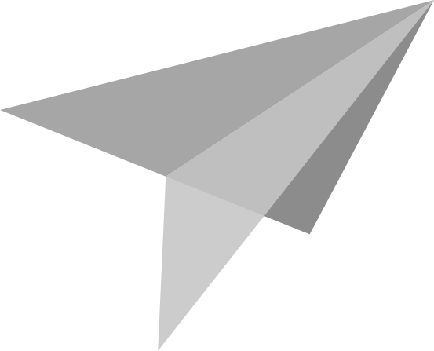

<div align="center">
    <h1>
        
        <br />
        Paperplane
    </h1>
    <a href="https://gitlab.com/rasmusmerzin/paperplane/-/commits/master">
        
    </a>
    <a href="https://crates.io/crates/paperplane">
        
    </a>
    <a href="https://crates.io/crates/paperplane">
        
    </a>
    <a href="https://docs.rs/paperplane">
        
    </a>
    <p>
        WebSocket library which utilizes
        <a href="https://crates.io/crates/async-std">async-std</a>,
        <a href="https://crates.io/crates/async-tungstenite">async-tungstenite</a> &
        <a href="https://crates.io/crates/futures">futures</a>.
        <br />
    </p>
</div>

## Example

```rust
use async_std::task;
use paperplane::tungstenite::Message;
use paperplane::Server;
use std::time;

fn main() {
    let server = Server::new(10);

    // Send count to all connected clients each second
    {
        let server = server.clone();
        task::spawn(async move {
            let mut count = 0usize;
            loop {
                task::sleep(time::Duration::from_secs(1)).await;
                server.send(None, count.to_string()).await.ok();
                count += 1;
            }
        });
    }

    // Print messages sent by clients
    task::block_on(async {
        server.listen("0.0.0.0:8000").await.unwrap();
        while let Some(event) = server.next::<Message>().await {
            println!("{:?}", event);
        }
    });
}
```

Simple duplex communication example.
See [examples folder](./examples) for more examples.
